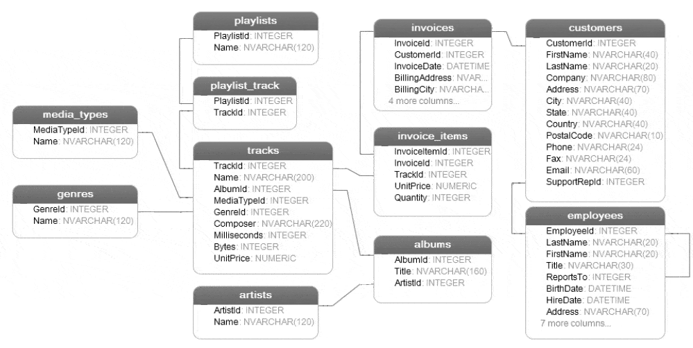

# Una base mas compleja 

En el archivo de [Exploracion](Exploracion.md) tenemos algunos ejemplos de como hacer una revisión básica de una base de
datos. La base que revisamos era simple, una tabla sin interacción con otras.
Para los siguientes ejercicios usaremos la base **chinook.db** que es mucho mas compleja y con relaciones entre las
diferentes tablas. Esta base tambien la podemos encontrar en su [pagina de github](https://github.com/lerocha/chinook-database)

Es un buen momento para revisarla con los comandos de esa sección y resolver las siguientes dudas:

- ¿Cuantas tablas tiene esta base?
- ¿Que tipo de información tiene?
- ¿Como se relacionan las tablas?

### ¿Cuantas tablas tiene esta base? 

Para saberlo necesitaríamos usar el comando 

```
.tables
```

### ¿Que tipo de información tiene?

En este caso ya con la información de las diferentes tablas podemos revisar algunas de las tablas por ejemplo:

```sql
SELECT * FROM customers;
```

Que nos mostraría el contenido de la tabla `customers`. O podemos probar la tabla `employees`:

```sql
SELECT * FROM employees;
```

Incluso podríamos revisar que empleado atendio a que cliente:

```sql
SELECT C.FirstName AS cliente, E.FirstName AS empleado 
FROM customers AS C 
  INNER JOIN employees AS E ON(C.SupportRepId = E.EmployeeId);  
```

En esta consulta por ejemplo encontramos terminos como:

- **AS** que permite poner un alias a una columna o una tabla.
- **INNER JOIN** Permite unir dos tablas, consideremos que **JOIN** = unión e **INNER** = interna. Esto nos determina
  que los elementos tienen que estar en ambas tablas.
- **ON** nos permite usar el campo que ambas tienen en común. 

Algunos de estos elementos los seguiremos revisando en otros apartados.

### ¿Como se relacionan las tablas?

Como vimos en el ejemplo anterior las dos tablas **employees** y **customers** se encuentran relacionadas entre sí por dos
campos con nombres distintos **SupportRepId** en **customers** y **EmployeeId** de la tabla employees.

Para saberlo podemos revisar el esquema de la base con el comando `.schem` de sqlite.
Con esto podemos ver como esta definida la columna **SupportRepId**

```sql
[SupportRepId] INTEGER,
    FOREIGN KEY ([SupportRepId]) REFERENCES "employees" ([EmployeeId]) 
		ON DELETE NO ACTION ON UPDATE NO ACTION
```

## Información en la tabla

Esta base contiene información de compras, clientes, empleados, albums y artistas. Y nos permite relizar una gran
cantidad de ejercicios. 

### Modelo de la base

